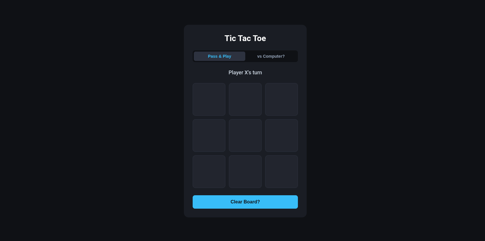

# Tic Tac Toe
Tic Tac Toe is a very famous game that is played by almost everyone accross the globe in pages BUT I made the game that is playable in the web. So, there are two modes:
- Pass and Play: You can play with your friend without wasting your paper YAY!
- Bot Mode: You can play with a bot who calculates and moves to stop you from winning.
## Technologies Used:
- HTML: I have used HTML obv to make the structure and define the elements ig.
- CSS: Used CSS obv to design the layour and make it more engaging.
- JS: Used JS to make the bot logic thing actually work and make switching modes thing work.
## How to use it?
You just need to go to https://summitgautam.github.io/tic-tac-toe/ and you can play there now!

## Insparation
I made this project because i wanted to practise some frontend js and make a simple project for some backend stuffs which i want to master rn.

Down here is the demo image of this tic tac toe game:

